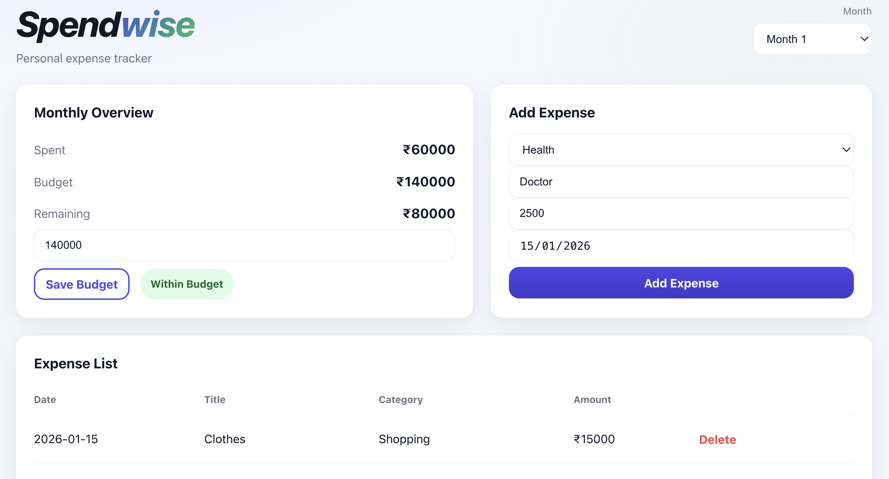
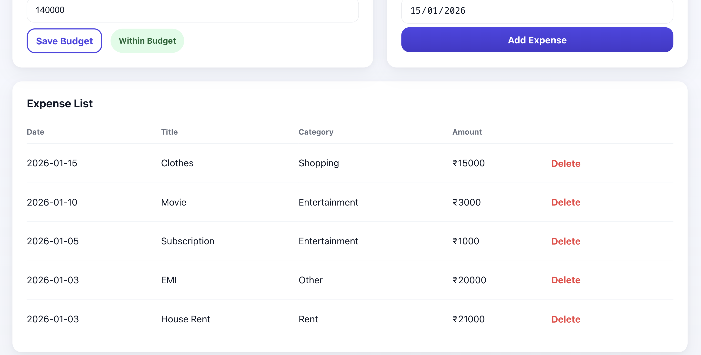
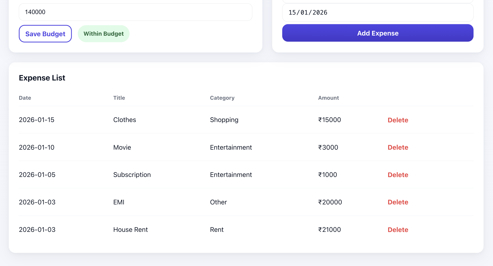

# Spendwise
**A personal expense tracker that allows users to record expenses, manage monthly budgets, and view summaries using a simple interface.**

Built to demonstrate real-world backend and frontend engineering using **Spring Boot, PostgreSQL, and React**.

> Track expenses, set monthly budgets, and instantly see how much you’ve spent vs. what’s left.

---

## Why Spendwise?
This project was built to simulate real-world product requirements:
- Month-wise financial tracking (not just CRUD)
- Budget vs spending reconciliation
- Clean REST APIs with proper domain modeling
- UI designed for clarity and usability

It focuses on **practical engineering decisions** rather than demo-only features.

---

## Features
- **Monthly summary dashboard** (Spent / Budget / Remaining)
- **Set & update monthly budget**
- **Add expenses** with category + smart title suggestions
- **Expense list** with delete support
- Month-wise tracking (budget + summary updates per selected month)

---

##  Tech Stack
**Backend**
- Java 17, Spring Boot
- Spring Web, Spring Data JPA, Validation
- PostgreSQL

**Frontend**
- React (Vite)
- Vanilla CSS (clean UI, recruiter-friendly)

---

## Architecture Overview
- **Backend:** Spring Boot REST API handling expenses, budgets, and monthly summaries
- **Database:** PostgreSQL with relational modeling for expenses and budgets
- **Frontend:** React (Vite) consuming REST APIs and updating UI state in real time

The frontend and backend are cleanly separated and communicate via JSON APIs.

---

##  Screenshots
> Add your screenshots in `docs/screenshots/`

### Dashboard

### Add Expense

### Expense List

---

## Prerequisites
Make sure you have:
- Java 17+
- Maven
- Node 20+
- PostgreSQL

---

## ⚙️ Setup (Run locally)

### 1) Backend (Spring Boot)

Go to backend folder:
cd spendwise-backend

Create DB in PostgreSQL:
CREATE DATABASE spendwise;

Run backend:
mvn spring-boot:run

Backend will run on:
http://localhost:8081

### 2) Frontend (React)

Go to frontend folder:
cd frontend

Install + run:
npm install
npm run dev

Frontend runs on:
http://localhost:5173

###  API Endpoints (v1)

GET /api/summary/monthly/{year}/{month}

PUT /api/budgets/monthly/{year}/{month}

GET /api/expenses

POST /api/expenses

DELETE /api/expenses/{id}
